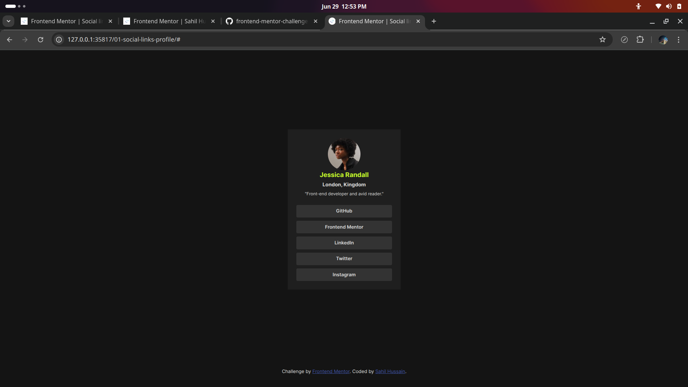
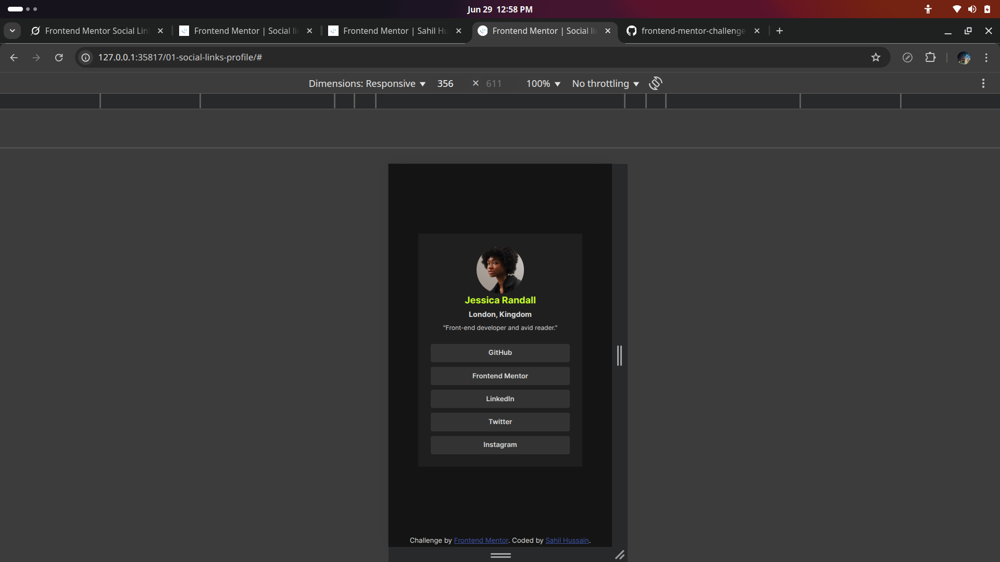

# Frontend Mentor - Social links profile solution

This is a solution to the Social links profile challenge on Frontend Mentor. Frontend Mentor challenges help you improve your coding skills by building realistic projects.

## Table of contents

- [Overview](#overview)
  - [The challenge](#the-challenge)
  - [Screenshot](#screenshot)
  - [Links](#links)
- [My process](#my-process)
  - [Built with](#built-with)
  - [What I learned](#what-i-learned)
  - [Continued development](#continued-development)
  - [Useful resources](#useful-resources)
- [Author](#author)
- [Acknowledgments](#acknowledgments)

**Note: This section will get updated everytime I make any significant change in my project or project directory.**

## Overview

### The challenge

Users should be able to:

- See hover and focus states for all interactive elements on the page

### Screenshot

### Links

- Solution URL: [Github](https://github.com/saaahilhussain/frontend-mentor-challenges/tree/main/01-social-links-profile)
- Live Site URL: (No live Site)

### Built with pure HTML5 & CSS3

- Semantic HTML5 markup

### What I learned

While working on this project, I clarified my understanding of styling links nested inside list items. This project helped me develop a new approach

### Continued development

I have no specific plans yet, but I liked the design of this project and might incorporate similar designs in future projects.

### Useful resources

- [MDN Web Docs](https://developer.mozilla.org/) - Provided reliable documentation for HTML and CSS.
- [W3Schools](https://www.w3schools.com/) - Offered clear examples and references for web development basics.

## Author

- Name - Sahil Hussain
- Frontend Mentor - [@saaahilhussain](https://www.frontendmentor.io/profile/saaahilhussain)
- Twitter - [@saaahilh](https://x.com/saaahilh)

## Acknowledgments

I learned everything for this project on my own using MDN Web Docs and W3Schools. While I learned JavaScript from Jonas Schmedtmann, it was not used in this project.
